
Guidance for how to use the features in the Explore Education Statistics platform

---

**The EES platform consists of two applications:**

1. The public website, where users access stats

2. The admin website, where production teams create their stats.

The admin side of EES is only supported in Google Chrome and Microsoft Edge. It will not work correctly in Internet Explorer. The public side does support Internet Explorer, though we still recommend that people use Chrome or Edge instead.

Both applications were initially released to Minimal Viable Product (MVP) standard, we will be iterating and improving the functionality based on user feedback throughout 2020 and 2021. 

Maintenance and BAU running of the platform is supported by the Statistics Development Team.

---

# How to access EES

---

As stated above, EES consists of two parts. We also have four versions (environments) of EES, the banner for the admin part of each environment will inform you which environment you are on, this is also colour coded: 

- **Development** - Green - where changes are first merged in, and often the first time different pieces of work from different developers will interact properly

- **Test** - Pink - where our tester carries out manual testing of any new features to make sure things work as expected 

- **Pre-production** - Yellow - a sandbox area for admin champions and functionality testing

- **Production** - Red - the real service, anyone creating real releases that they intend to publish to the public should be using this environment

There is no overlap between the environments and content created on one cannot be moved to any other. We recommend that teams use the pre-production environment to familiarise themselves with the platform and test out what is possible, you can dummy publishing a publication to see what it will look like on the public website by following the process for publishing. Publications will go out at 8:30am on the scheduled day on pre-production, mirroring the way that production runs (though one hour earlier).

The core functionality across the environments is identical except for new changes, which are deployed through the different environments in order before they make it to production.

On the pre-production environment, all analysts have full permissions to create publications and releases, and see everything else that other analysts are making. This is unqiue to the pre-production environment, on the production environment analysts will only have access to releases that they have been granted specific access to.

Jobshare emails can not be used to access EES. Specific personal emails should be used instead, in the same way as you sign in to windows on your machine.

The Statistics Development Team will be responsible for setting up and maintaining user permissions during the beta phase. Change requests will be monitored via their main mailbox - explore.statistics@education.gov.uk. 

If you are bookmarking links, please be careful to bookmark the links below exactly as they are shown. Often when signing in you will be redirected via other url's as a part of the authentication process, and bookmarking those may lead to errors.

---

## Production environment

---

Admin - https://admin.explore-education-statistics.service.gov.uk/

Public - https://explore-education-statistics.service.gov.uk/

Access to the production admin service is limited to DfE AD accounts only and users have to have been invited to the service by either the Statistics Development Team (for full access) or an existing user (for pre-release access). Invites to the service are sent out via email using gov.uk Notify. 

To be invited to the service for full access teams need to email the [Explore Statistics Mailbox](mailto:explore.statistics@education.gov.uk), stating who needs access, what permissions they require (analyst or approver), and for which publications these apply. Approvers are traditionally DD's though sometimes this responsibility may be delegated. This email should be sent by the Team Leader, or accompanied with the relevant Team Leader’s approval. Once access has been granted you will receive an email inviting you to use the platform.

At first we'll be inviting analysts to the admin site in phases, depending upon when they expect to first publish statistics via EES. This is so we can ensure we're providing sufficient support and have awareness of what releases are going out in the short term. 

---

## Pre-production environment

---

Admin pre-production - https://admin.pre-production.explore-education-statistics.service.gov.uk

Public pre-production - https://pre-production.explore-education-statistics.service.gov.uk

Analysts are able to test the service within the EES pre-production environment, and it is recommended that production teams start here until they are confident they know how they want to build their release for real (again, please contact the [Explore Statistics Mailbox](mailto:explore.statistics@education.gov.uk) to request access).

When accessing the pre-production environment you may be asked for a username and password, these are as follows: dfe, dataresearch.

The pre-production environment is not suitable for unpublished data. Unpublished data should only be uploaded to the production environment.

---

## Admin dashboard

---

Use Google Chrome or Microsoft Edge to access and use the admin part of Explore Education Statistics.

When you enter the service you’ll see the admin dashboard, here what you can see will be dependent on your access permissions i.e. you’ll only see the publications that you have been granted access to. Within the test environment users are set up with full permissions (i.e. they can see/do everything) though in our production environment this will be restricted. 

The Statistics Development Team will be responsible for setting up and maintaining user permissions during the beta phase. Change requests will be monitored via their EES mailbox - explore.statistics@education.gov.uk. 

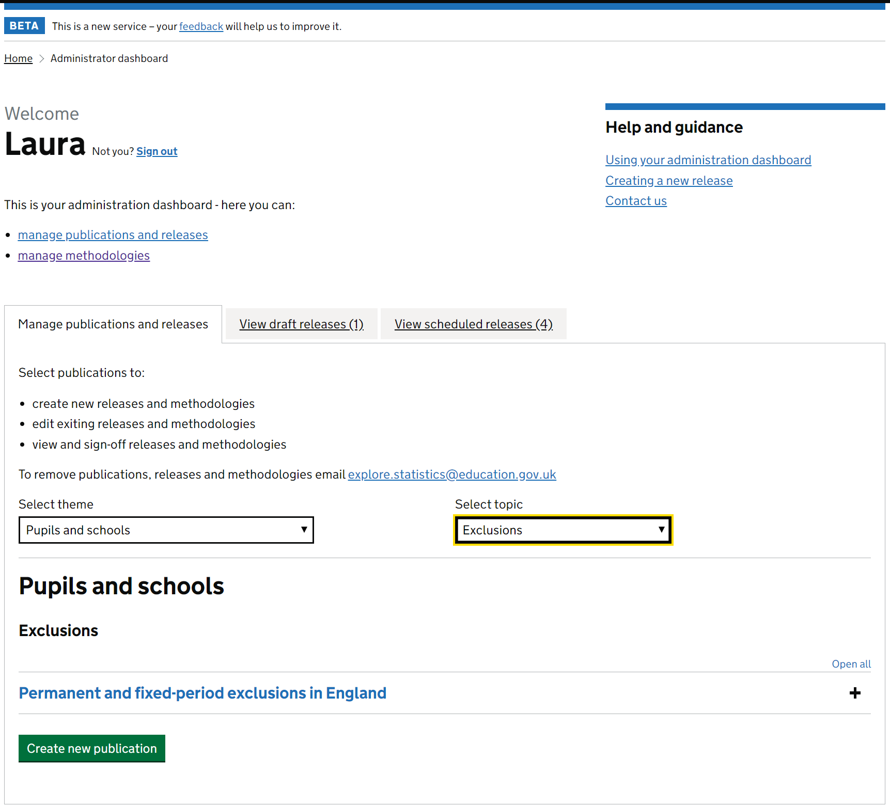<!-- -->

Within this dashboard you can access existing publications to create/edit their releases. You can use the drop down lists to find releases by theme/topic/publication or use the draft and schedule releases tabs to see releases that are in progress. 

Help and guidance for how to use the the admin website is available via the [administrators guide](https://admin.explore-education-statistics.service.gov.uk/documentation){target="_blank" rel="noopener noreferrer"}, this is always accessible from the top bar of the admin side of EES, as shown in the image below. 

<!-- -->

---

# Publications 

---

The hierarchy of content within EES is as follows - 

Publications are organised into topics and themes (as shown on the EES Find Statistics page), and then within each publication there are releases - where the latest release includes the latest statistics for that publication. For example:

| Level | Example |
|:------|:------|
| Theme | Pupils and Schools |
| Topic | Pupil absence |
| Publication | Pupil absence in schools in England |
| Release | 2018/19 |

Each publication should have a lead statistician's name and contact details attached to it as a requirement of the Code of Practice. You may use a team email address but the name and telephone number of a named statistician must also be provided. 

To request a change to the contact details for a publication contact the [Explore Statistics Mailbox](mailto:explore.statistics@education.gov.uk).

Methodology documentation is also attached at a publication level within EES - meaning one standalone piece should be written to cover all releases for the given publication within the service. 

If you want to request a new publication, please be prepared to give the following:

+ The heading and subheading that you want the publication to sit under in our site (take a look at the current structure [here](https://explore-education-statistics.service.gov.uk/find-statistics){target="_blank" rel="noopener noreferrer"}), feel free to either use existing ones, or suggest new ones
+ The exact title of the publication
+ If the methodology already exists elsewhere and you have a URL for it, or if you want to [create one](#Methodology)
+ Team name
+ Team email address
+ Lead statistician name
+ Lead statistician contact number
+ The [year](https://rsconnect/rsc/stats-production-guidance/ud.html#list_of_allowable_time_values){target="_blank" rel="noopener noreferrer"} of the release you’re creating
+ Whether they are National statistics, an ad-hoc publication, or official statistics
+ List of email addresses of analysts who need access to edit the release
+ Email address for whoever is providing [senior sign off](#Signing_off_a_release)

---

# Create new release

---

After finding the publication you want to create a release for, just press the button to create a new release. 

Currently the following tyes of release can be created in EES: 

* National Statistics (includes OSR tick mark logo at the top of the release page)  
* Official Statistics
* Adhoc Statistics

When creating a release you will be asked to fill in some release summary fields, including the scheduled publication date. 

The time period for the release should reflect the time period of the data that this latest release adds to the time series.

You also have the option to add the 'next expected update date' for which you can provide the planned month and year of the next release within this publication. If this is added but then needs to be changed later in the year it is easy to do so, contact the [Explore Statistics Mailbox](mailto:explore.statistics@education.gov.uk) in the first instance.

Whilst in public beta, the Statistics Development Team are the only ones who can create new releases within the production environment – this is so we have awareness of all the early users within the admin site and can supply appropriate support. 

Once you have created your release you will see enter the ‘create release dashboard, here you need to work through the following tabs to create your release:

1.	Data and files (uploading data files, ancillary files and creating public metadata)

2.  Footnotes (creating footnotes and assigning to relevant data)

2.	Data blocks (creating summary tables, charts and key stats indicators)

3.	Content (drafting release content)

4.	Sign off (moving through the approval process)

5.  Pre-release access (invite users to pre-release and create public pre-release list)

--- 

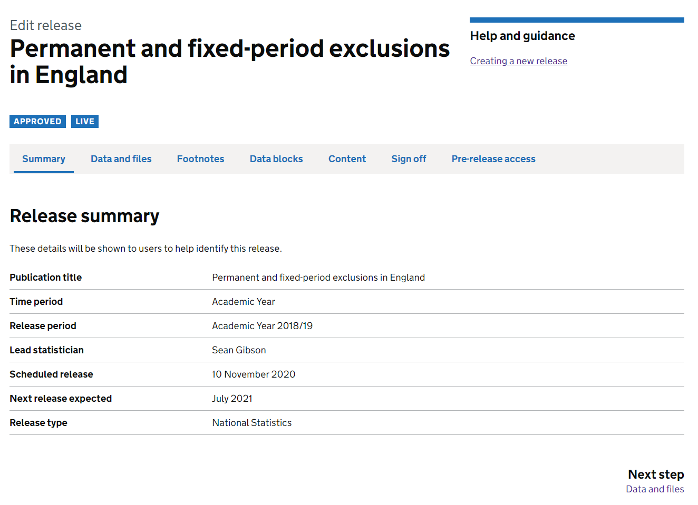<!-- -->

---

# Managing legacy releases

---

Past publications on other services can be added to the previous releases links that appear on the top right of a release page by using the 'Manage legacy releases' section. In here you can add links to previous releases and choose the order in which they appear. 

For the time being this can only be done by the Statistics Development Team, please get in touch if you'd like us to add any legacy releases for your publication.

The video below walks through this:

<video width="640" height="360" controls>
  <source src="images/manageLegacyReleases.mp4" type="video/mp4">
</video>

---

# Uploading data and files

---

## Data uploads

---

Here you will update your tidy data files and accompanying metadata. You need to make sure that the data has passed through our data screener checks before trying to upload it. 

Planning area, School, Provider, and Institution level data will upload as normal to EES, though will not be read into the table tool or data blocks, as they are not yet designed for these levels of data. All data, including these levels are accessible in the downloadable files for users to explore in the same format as they are uploaded. Any data files that only consist of these levels should be uploaded as an ancillary file, rather than as a data file.

Once you click to upload the file a ‘Status’ will be visible that shows the progress of the import process. It will go through the following stages:

* Queued
* Validating
* Importing
* Complete

This may take a little while depending on the size of your file and if there are numerous files queued for import. You cannot view the dataset or use it to create tables/charts until this status is ‘COMPLETE’.

For data files greater than 80mb we recommend uploading as a ZIP file.

If you believe your file is ‘stuck’ please contact explore.statistics@education.gov.uk, with details of the file and the release that you are uploading to.

---

### Subject names

---

You'll need to give a 'subject name' to each data file you upload. The subject name should be a simple user-friendly title for the data included within the file - it is what users will see wherever the file is referenced within EES. The actual file name can include more technical / coverage information.

When adding a subject name think about the general user and how the subjects will appear in the table tool - for example, you don't need to include the publication name in the subject name as this is always already implied within EES. 

---

## Ancillary file uploads

---

Any files you want to make available for users to download but aren't intended the table tool should be added as an ancillary file upload. These files will need to meet all requirements of the new [accesibility regulations](https://www.gov.uk/guidance/publishing-accessible-documents) before they can be published. 

Examples of ancillary files may be: 

* Infographic pages
* Supplementary data that isn't intended for the table tool 
* Additional technical documentation
* Images

Any data files that only consist of Planning area, School, Provider, and/or Institution level data should be uploaded as an ancillary file, rather than as a data file.

---

## Metadata guidance

---

Here you should also create your [public metadata](https://explore-education-statistics.service.gov.uk/find-statistics/permanent-and-fixed-period-exclusions-in-england/meta-guidance) guidance document, this replaces the information that would have previously been uploaded as a pdf and is designed to help users understand and use the data they download from your release.

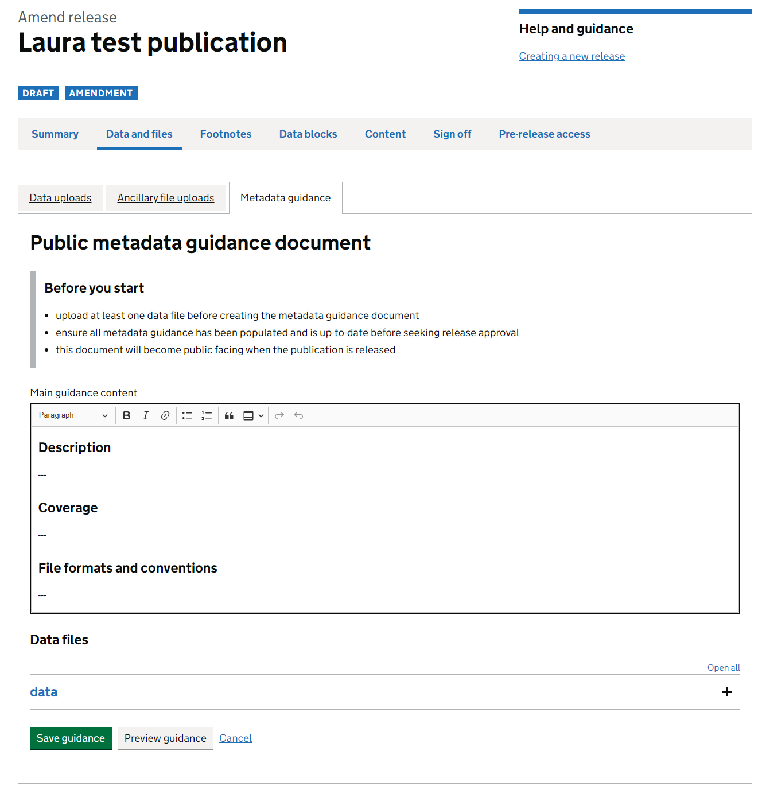<!-- -->

The document will automatically update as you add new data files to your release, however you will need to add an overview of all the data included in the release and short summaries for each data file before the release can be published. 

A list of variables in each file with an associated label (taken from metadata uploads) will also be displayed with each file. 

This template follows a similar format to our previous recommended [metadata template](https://educationgovuk.sharepoint.com/:f:/r/sites/DfEStatisticsCoherence/Shared%20Documents/Templates%20-%20Explore%20Education%20Statistics?csf=1&e=7iJoUy) so for most publications this will involve a copy/paste from existing content. 

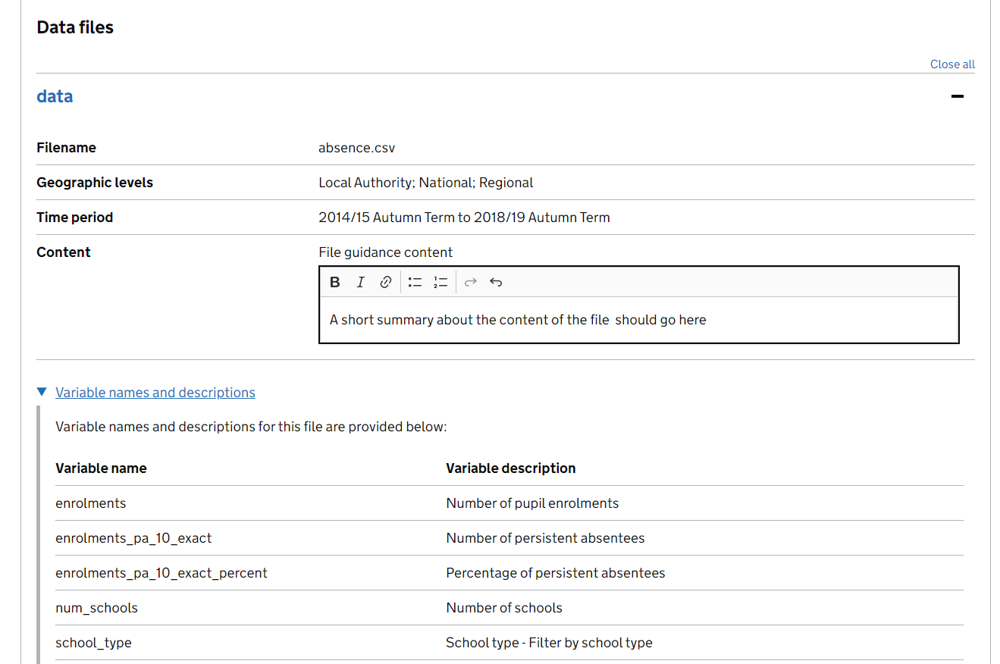<!-- -->

Releases cannot be published without a completed metadata document. If not filled in an error will be flagged during sign off. 

---

## Replacing data

---

If you notice a mistake in your data file you can replace it with another.

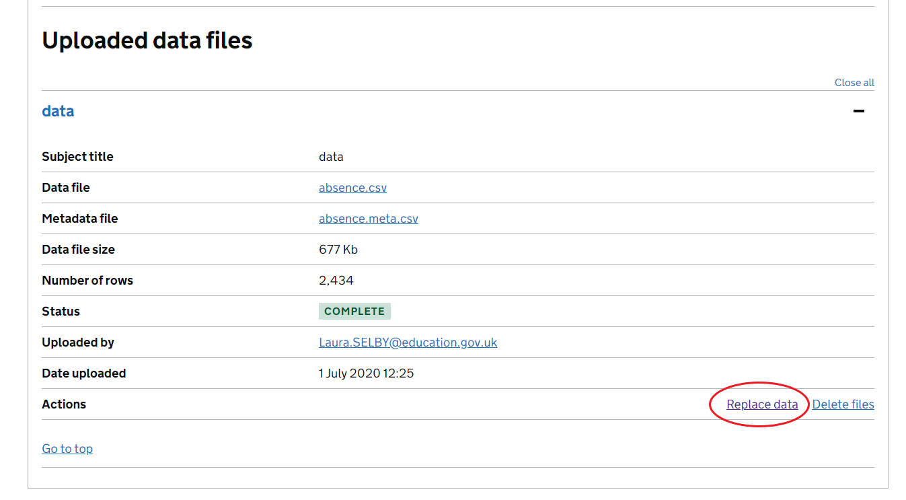<!-- -->

When replacing a data file the platform will attempt to recreate any data blocks and footnotes that were built using the previous file.

The first step is to upload the new file.

<!-- -->

One you've chosen and uploaded your replacement file it will need to go through the usual import process before it can check if retaining existing data blocks and footnotes will be possible.

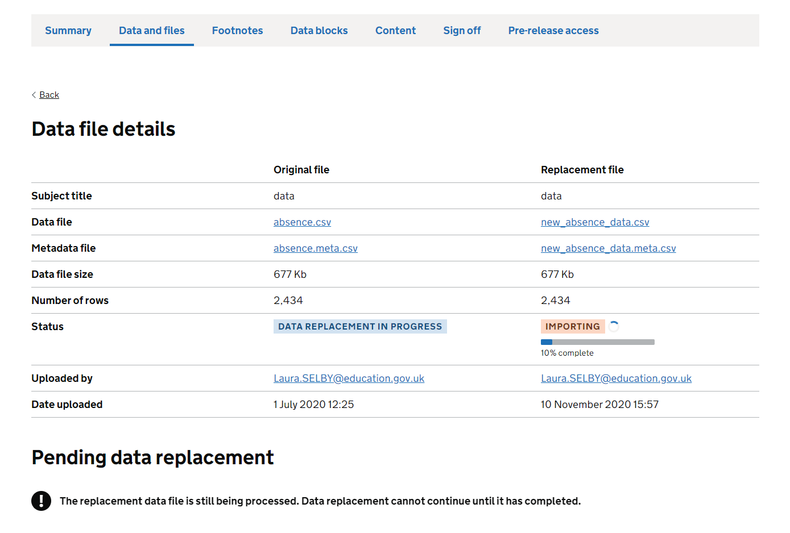<!-- -->

Once the upload is finished a report will appear which highlights whether existing data blocks and footnotes can be replaced successfully. If you want to keep any data blocks and footnotes you've built you will need to make sure that your replacement data file still contains the information (indicators, filters, geographic_levels and time_periods) that was used to create them.

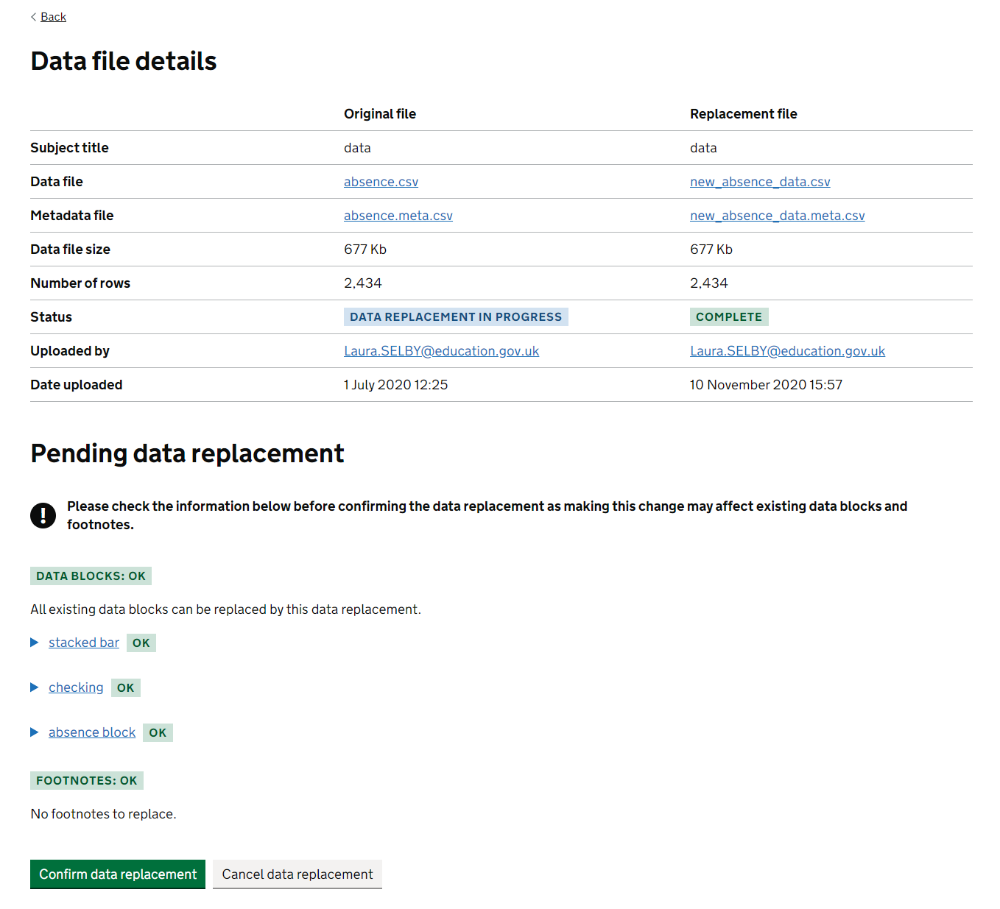<!-- -->

If it's not possible for a data block or footnote to be recreated using the replacing data file a warning will appear and you'll be prompted to either edit or delete them before completing the replacement.

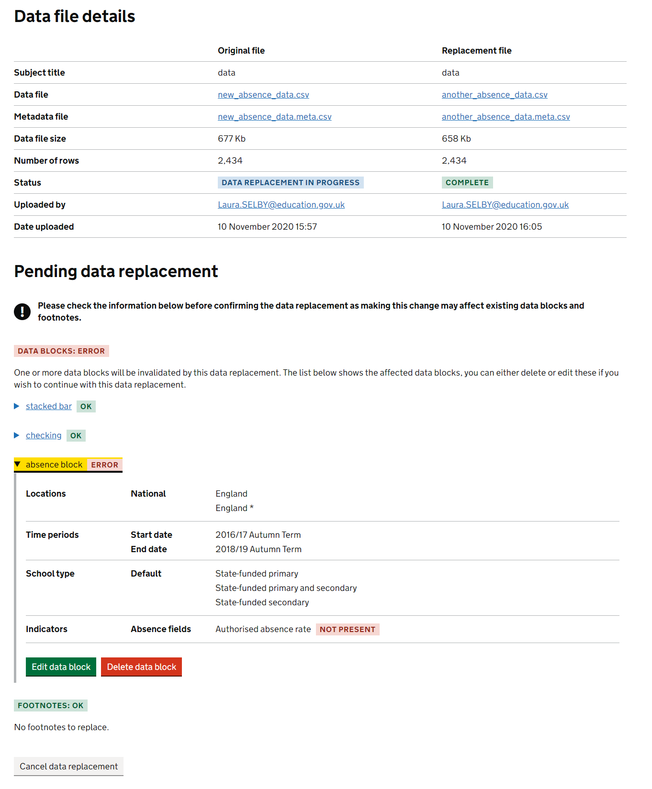<!-- -->

Remember to double check any data blocks or footnotes that were recreated by the platform before publishing your release.

---

# Adding footnotes

---

To add footnotes, go to the footnotes tab and click 'add another footnote'. Rather than writing multiple tables and assigning individual footnotes, you write footnotes and assign them to certain indicators and filters so they appear when users select them in the table builder. For example in the below, the footnote "This is a footnote" is assigned to "the number of pupils entering each exam" for all filters.

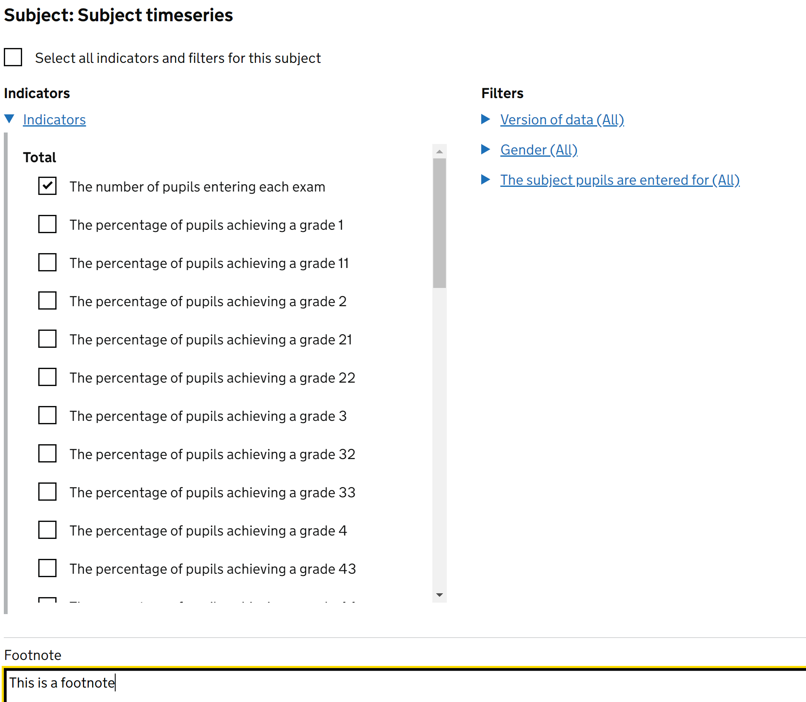<!-- -->

Now, when a user goes to build a table with this indicator, the footnote automatically appears.

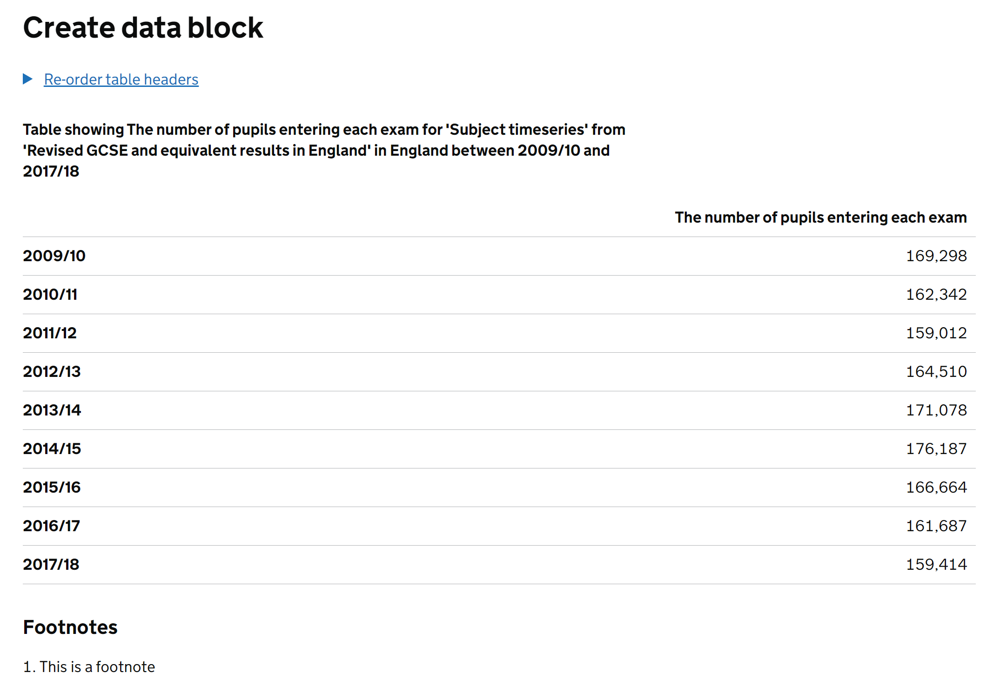<!-- -->

If you'd rather, you can assign a footnote to the whole data file by ticking this box. 

<!-- -->

You can assign footnotes across multiple data files.  

We recommend that you only add footnotes once you are certain the data file is final. If you have to delete the data file, all the assigned footnotes will be deleted alongside it.

 

---

# Data block tables

---

Once file imports are complete move to manage data blocks tab and use the admin table tool to create your summary tables. Here you can also use the reorder table headers tool to restructure your table however you want it. 

Once you're happy with your table, give it a title and some source information before clicking save. 

---

## Table highlights

---

You can also choose to highlight a data block table as a ‘top table’ which means it will show in a list of table highlights within the table tool. This is designed to help users get to tables of interest more quickly (without having to create tables themselves).

There is an option to choose if a table is a 'highlight table' when saving each data block:

<!-- -->

Each highlight table will then be listed to the user within the table tool. Highlight tables do not have to be embedded within your release content to be included in this list. 

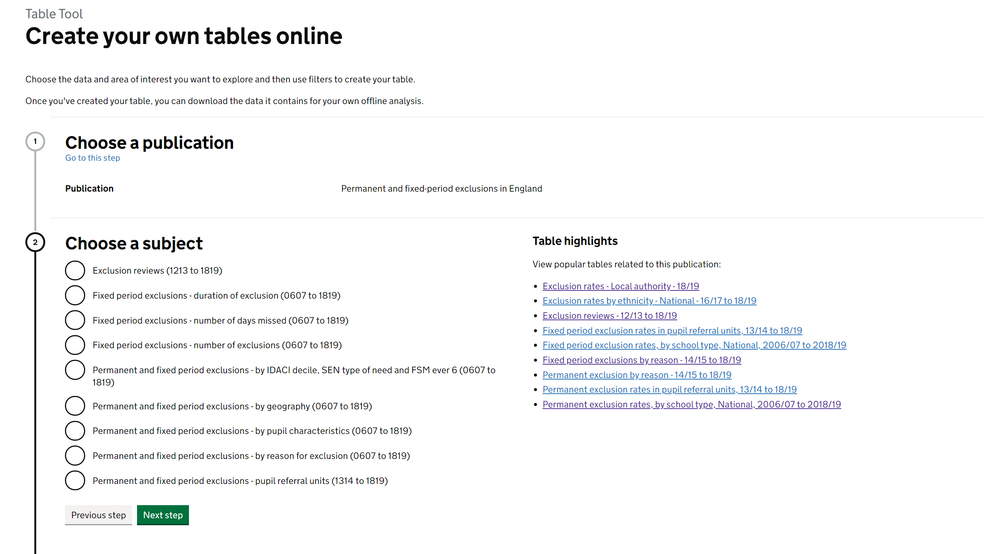<!-- -->

---

## Fast track links

---

Any data block tables that are created and saved within the admin app will also be assigned a ‘fast-track link’, this url can then be used throughout your release as a way to direct users to specific tables (within the table tool) more quickly so they can interact and explore the data further.  It will appear at the top of the page like this:

<!-- -->

When your release is published, any embedded data block tables within the release will have an 'explore data button' beneath them which will utilise these fast track links to quickly direct users to the table within the table tool so they can explore the data further. You can also use fast-track links as a hyperlink within release commentary (without having to embed the data block). 

**What is the difference between a fast-track link and a permalink?**

EES also offers 'permalinks' for any table created in the table tool which allows a user to save a link to a permanent, static, version of a table they have created. Analysts can make use of these permalinks when answering queries or in PQ and FOI responses. 

Fast-track links are similar to permalinks however instead of linking to a static version of a table they link to an 'active' version of the table within the table tool - meaning users can interact and change what's shown in the table from within the table tool if they choose to.  

---

# Data block charts

---

After building and saving a data block table you will see a 'Chart' tab appears. This tab will take you to the EES chart builder, where you can choose to add a chart to your data block.

The first step to creating a chart is choosing the chart type, currently the EES chart builder can build line charts, horizontal/vertical bar charts (including stacked) and maps. We intend to grow this list over the course of public beta so please let us know if a chart type you want to create is not possible. 

After choosing your chart type you then need to work through the following stages and you’ll be shown a live preview as you go: 

---

## Chart configuration

---

Within the ‘chart configuration’ tab you can add a title, alt text, move the legend and change chart dimensions. 

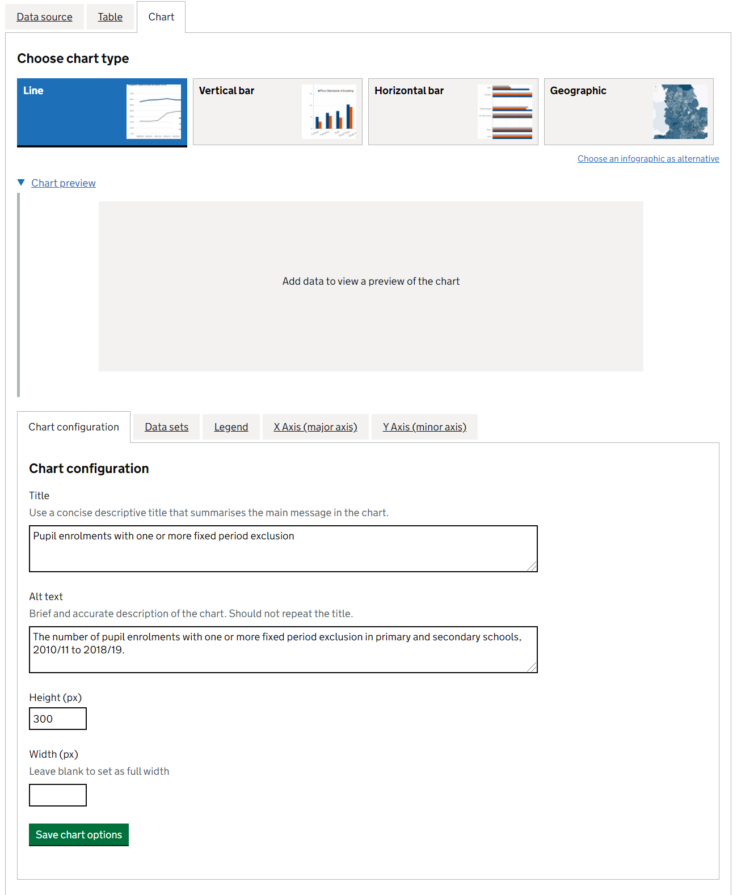<!-- -->

Note, within the vertical and horizontal bar chart types you can also create stacked bar charts via the chart configuration options.

---

## Data sets

---

Here is where you add data to the chart. Each series is added one at a time.

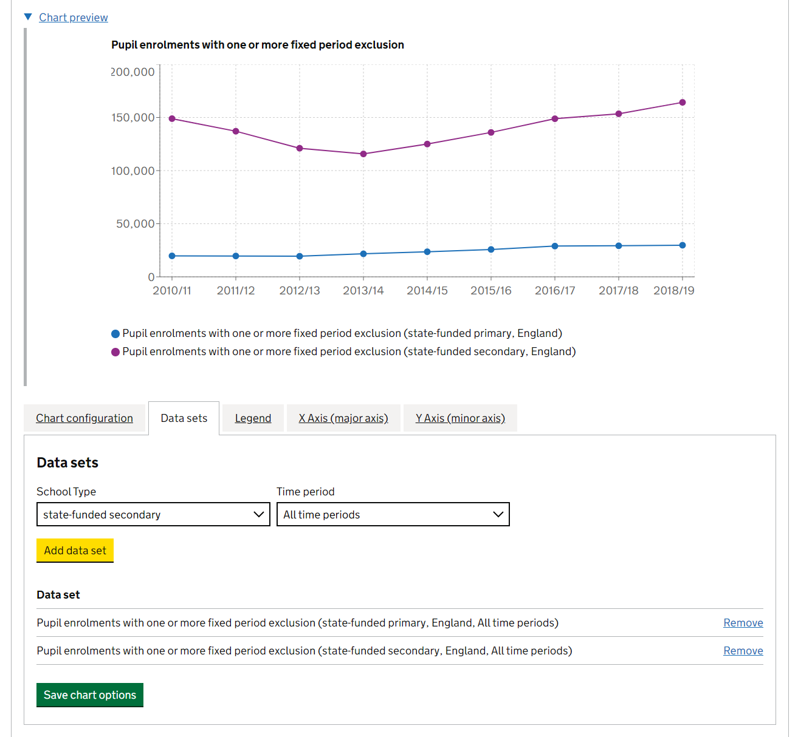<!-- -->

---

## Legend

---

You can edit the chart legend, and styling of your series via the Legend tab. 

<!-- -->

---

## X axis (major axis)

---

Here is where you configure the x-axis: You can alter gridlines, labels, sort, limit and add reference lines.

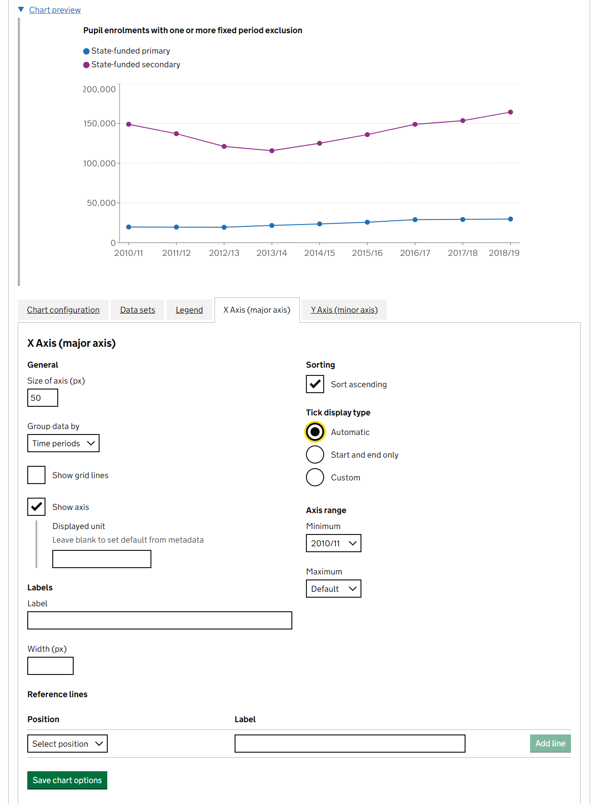<!-- -->

|Option|What it does|
|---------|---------|
|Size of axis |Change the width of the space given to axis tick labels|
|Group data by |Change how the data within the chart is grouped|
|Show grid lines |Turn grid lines on and off|
|Show axis |Turn the axis on and off, you can also add a unit to the axis tick labels|
|Sorting |Change how the data within the chart is sorted|
|Tick display type |Alter how often axis tick labels are shown, labels will automatically skip values where there are too many to show without overlapping|
|Axis range |Alter the range of data shown in the chart|
|Label |Add an axis label, you can also choose the width for the space given to it|
|Reference lines |Add/remove  reference lines to the chart|

---

## Y axis (minor axis)

---

Then follow a similar process for the y axis configuration, play around until the chart looks how you want it to.

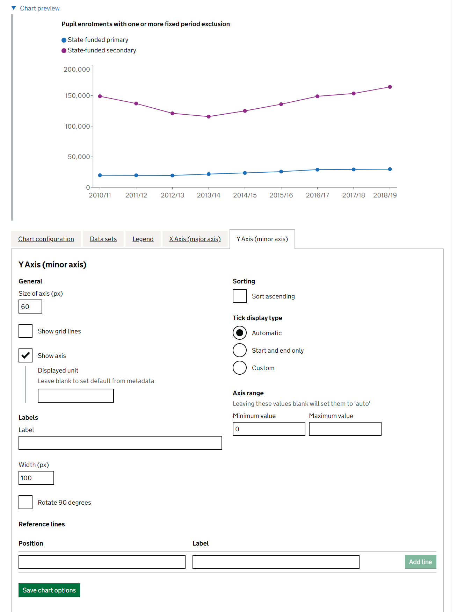<!-- -->

|Option|What it does|
|---------|---------|
|Size of axis |Change the width of the space given to axis tick labels|
|Group data by |Change how the data within the chart is grouped|
|Show grid lines |Turn grid lines on and off|
|Show axis |Turn the axis on and off, you can also add a unit to the axis tick labels|
|Sorting |Change how the data within the chart is sorted|
|Tick display type |Alter how often axis tick labels are shown, labels will automatically skip values where there are too many to show without overlapping|
|Axis range |Alter the range of data shown in the chart|
|Label |Add an axis label, you can also choose the width for the space given to it|
|Reference lines |Add/remove  reference lines to the chart|

---

## Changing chart type

---

If you create your chart and then change your mind as to what chart type would be best you can just click to change it and it will try to save all the options that you had applied previously.

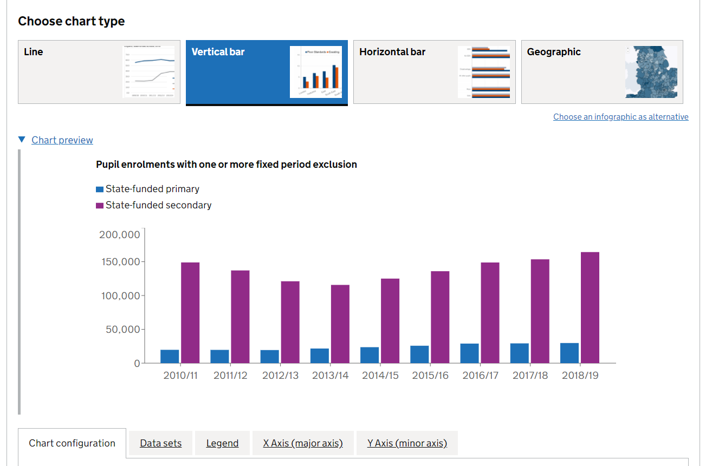<!-- -->

You can create maps too, currently this is possible for regional, LA and LAD data, though remember your source table needs to include information for all geographies in your map to be able to map them.

Remember to save your chart when you’re done.

---

## Other chart types

---

You should only use complex charts where there is a clear user need, as simple charts are the easiest for users to understand. If you have a an infographic or a chart that is too complex to build within our chart builder you can use the 'Choose an infographic as alternative' option to upload an image to your data block instead. These should be .svg format and you can use the sizing options within the data block editor to size your image appropriately. 

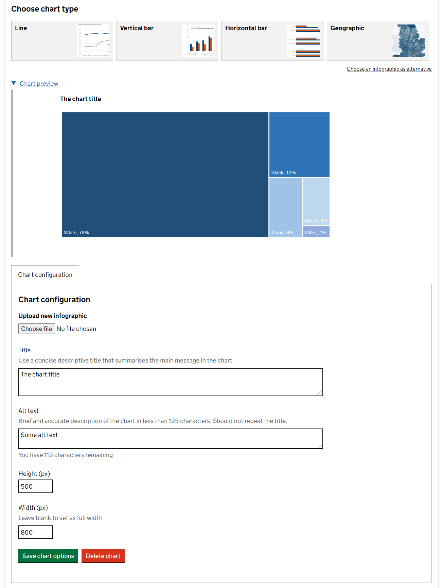<!-- -->

Accessibility matters for infographics too, consider the following if you do need to upload an image - 

* Keep them simple
* Use [GDS colours](https://design-system.service.gov.uk/styles/colour/)
* Don't put borders around images
* Ensure there is a high enough colour contrast ratio between elements. You can use a [colour contrast checker](https://contrast-checker.glitch.me/) to check the colours you're using

---

# Writing content

---

In the manage content tab you can now start creating your release, embedding the datablocks you’ve created as you go. 

<!-- potential for gif? --> 

You can use the page view toggles, that float in the bottom left of the page, to jump between edit and preview mode.

<!-- potential for gif? --> 

Use the ‘Add secondary stats’ button to add a datablock to your headline stats section. 

<!-- potential for gif? --> 

Use the 'Key stats' options to add key statistic tiles to your release. For each tile you first have to have created a datablock with a only a single number.

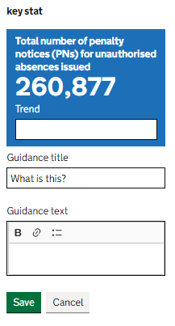<!-- -->

After embedding a key stat tile you can then edit it to add trend information and a description of what the indicator is. 

| Element | Content |
|---------|---------|
| Indicator name | Automatically generated from your data | 
| Latest value | Automatically generated from your data |
| Trend | A short one-sentence description of the trend; try to avoid only stating the change from the previous year and talk about the longer-term trend where appropriate |
| Guidance title | Should be set to 'What is this?' |
| Guidance text | A simple description in plain English of what the indicator is |

You can then create accordion sections to start adding your main release commentary. These sections are made up of text blocks and data blocks which can be reordered as needed. 

Any data tables should be included as data blocks, however you can also embed static html tables within a text box. These should only be used to present textual tables or for any small presentations of data that are not possible to do in a data block at the moment. 

You can create static html tables for presenting information that isn't embedded in a datablock. However, remember that *all of the data* included or referred to in your content should be available (or createable) from the downloadable underlying data files.

---

# Signing off a release

---

Once you’re happy with your release you need to go to the sign off page and change it’s status in order to move it through the release pipeline.

There are three statuses:

1.	**In draft** (where the production team work on drafting the release)
2.	**Ready for higher review** (where the senior statistician checks over the release before approving)
3.	**Approved for publication** (after approval has been given, releases in this status will be published on their scheduled date)

Only users with ‘responsible statistician’ permissions (usually G6 or above) can sign off the release for publication.  

---

## Release checklist

---

There's quite a few things to remember to do as you build your release so to help ensure you haven't missed anything a release checklist is also available via the sign off page

The checklist can be accessed by clicking to edit release status. 

Remember to check over it before you submit your release for approval as a release that has outstanding warnings on it will not be able to be published.

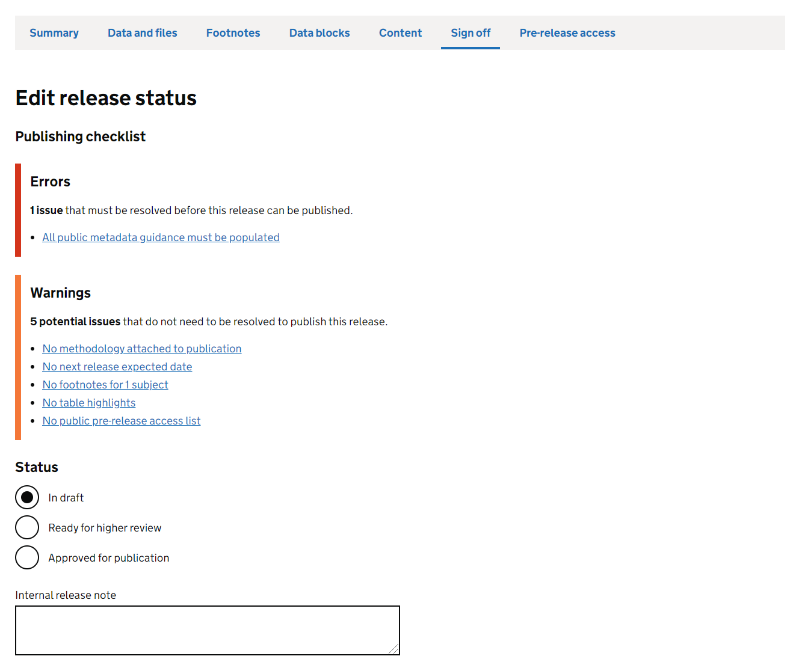<!-- -->

---

## How to approve a release

---

Releases are approved via the sign off tab. The release date is also set during this stage of the process. All releases scheduled for a specific date will be published at 9:30am on that day. 

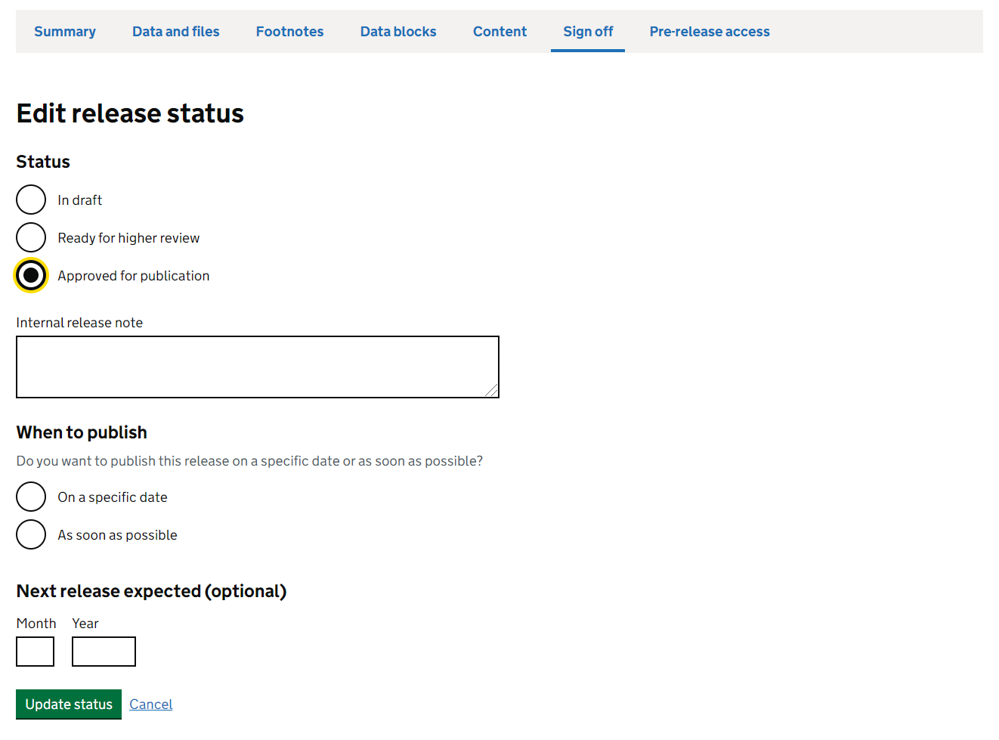<!-- -->

The approver has the ability to approve the release to be published on a specific date or to publish as soon as possible. Publishing as soon as possible is useful for publishing amendments to existing releases. 

This page also gives you the expected release url which may be useful to know for other things, for example, sending to the webteam to add to your gov.uk announcement page. 

---

# Pre-release

---

Prior to each release going live the production team are also able to grant pre-release access to a named group of users 24 hours before it goes live. These users do not require full access to the whole admin service. They will be able to see preview versions of any releases they have been granted access to. 

This preview is only accessible for the 24 hours before the publication date, the emails may go out to users before then. We expect teams will continue to send an email at 09:30 on pre-release day, including any additional briefing and the link to the pre-release area. 

Jobshare emails should not be sent invites for pre-release. The personal emails for the specific individuals should be used instead, as jobshare emails do not have active accounts with DfE to access EES.

Pre-release access via Explore Education Statistics is currently limited to DFE users only, if you need to share your release with external users you will need to do so outside of the system. 

---

## Overview

---

<html>
<centre>
<head>
<title>EES PRA one pager</title>
<meta charset="utf-8"/>
</head>
<body>

</body>
</centre>
</html>

---

## Walkthrough

---

Inviting users for pre-release access and building the public pre-release list can be found within the ‘Pre-release access’ tab on the dashboard. 

Once the release has been marked as approved, go to the  ‘Pre-release access’ tab and add the relevant email addresses to grant pre-release access. All invited users will receive an email to say that they have been given pre-release access and will get a url where the preview release will be available. 

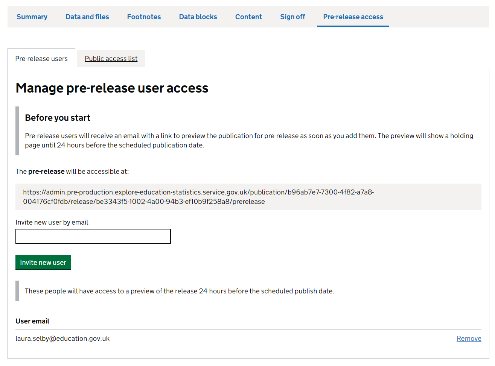<!-- -->

You should also create the public facing pre-release access page by clicking the ‘Public access list’ tab.

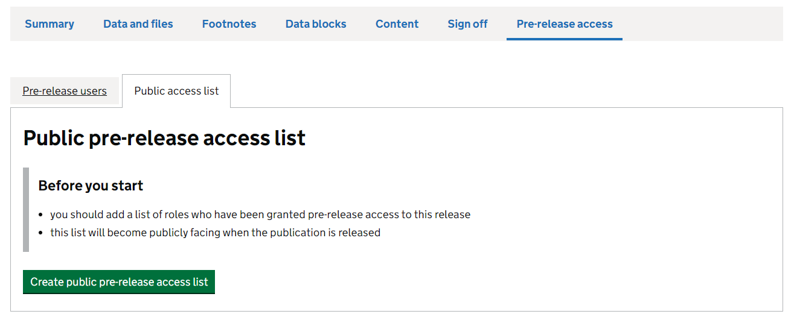<!-- -->

After creating your pre-release access list a text editor will appear where you can list the roles that have been given early access to the release. This list will then appear in the list of file downloads at the top of each release. 

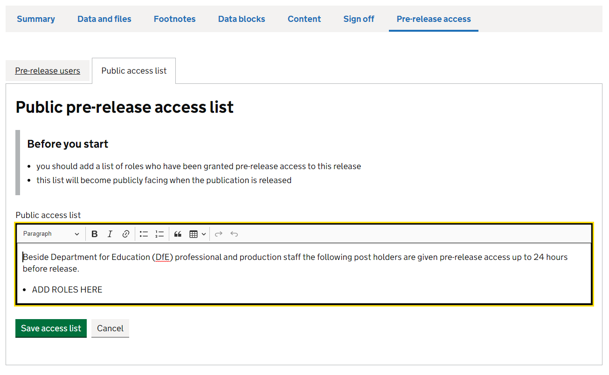<!-- -->

---

# Methodology

---

Methodologies work in a very similar way to the written content of a release, the text editor and static tables you can use are built on the same foundations. 

On the production environment, teams need to request a blank methodology to be created for them, please contact the [Explore Statistics Mailbox](mailto:explore.statistics@education.gov.uk) to arrange this.

Once the drafting has finished, a methodology should be set as 'approved for publication'. After this has happened, it will then appear in the drop down menu to attach to a publication. The methodology will then be published to the public side of the platform with the next release.

On the test environment, teams can test creating methodologies themselves by going into the 'manage methodologies' page that is accessible from the main admin dashboard.

---

# Amending a release

---

If you need to make an amendment to release that has already been published this is now possible to do from within the admin dashboard:

<!-- -->

Creating an amendment of a release will create a new version for which you can make any changes and then choose to republish, either as soon as possible or on a given date. 

---

## Release notes

---

When publishing a new amendment you should add a 'release note' to your release so users can be informed of what has changed:

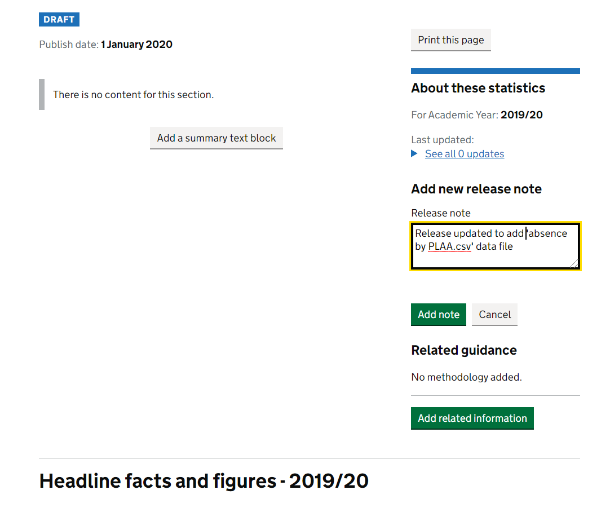<!-- -->
